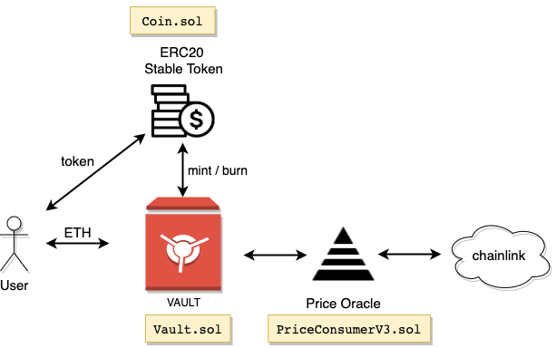

# Ethereum Vault

- [Ethereum Vault](#ethereum-vault)
  - [1. About](#1-about)
  - [2. Project description](#2-project-description)
  - [3. Smart contracts](#3-smart-contracts)
  - [4. Install](#4-install)
  - [5. Running tests](#5-running-tests)
    - [Testing in Ganache](#testing-in-ganache)
    - [Testing in Kovan](#testing-in-kovan)
    - [Test suite output](#test-suite-output)
  - [6. Deployed contracts in Kovan testnet](#6-deployed-contracts-in-kovan-testnet)
  - [7. TODO](#7-todo)

## 1. About

This repository contains the source code and dependencies required to deploy a Solidity based VAULT smart contract that securely holds ETH whilst lending STABLE TOKEN to users on Ethereum network.

## 2. Project description

This project implements a Vault that allows a user to borrow a stable token (pegged to USD) by depositing ether into the Vault as collateral.

The amount of tokens that can be borrowed is derived from the ETH/USD price provided by an on-chain oracle.

The user is allowed to withdraw the collateral after repaying the borrowed tokens.

The amount of collateral available to withdraw depends on the current ETH/USD price provided by the Oracle.

The diagram below shows a high level overview with the main components and its interactions



## 3. Smart contracts
The smart contracts in the project are:

`Vault.sol`

- implements the business logic of the Vault
- exposes 5 main functions

```javascript
deposit(uint256 amountToDeposit) // Allows a user to deposit ETH collateral in exchange for some amount of stablecoin
withdraw(uint256 repaymentAmount)  // Allows a user to withdraw up to 100% of the collateral they have on deposit
getVault(address userAddress) //Returns the details of a vault
estimateCollateralAmount(uint256 repaymentAmount) // Returns an estimate of how much collateral could be withdrawn for a given amount of stablecoin
estimateTokenAmount(uint256 depositAmount) // Returns an estimate on how much stable coin could be minted at the current rate
```

`Coin.sol`

- ERC20 standard token
- implemens `mint` and `burn`

`PriceConsumerV3.sol`

- On chain oracle
- Leverages on chainlink price feed

## 4. Install

Truffle and Ganache are required to deploy and test this project.
They can be installed by running:

```
$ npm install -g truffle
$ npm install -g ganache-cli
```

Clone the repository and install dependencies:

```
$ npm install
```

## 5. Running tests

This project includes a test suite based in Truffle/Mocha.

Tests can be run on local Ganache or on Kovan.

### Testing in Ganache

To run test in Ganache environment, a Ganache instance must be running on port 7545

You can start Ganache by executing the following:

```
$ ganache-cli -p 7545
```

To execute test suite, on a different terminal run:

```
truffle test --network development
```

### Testing in Kovan

The following is required to run test cases in Kovan network

- infura account

  
  API project KEY from https://infura.io enabled on KOVAN endpoint

- Kovan ether funds available
  
  At least 2 funded accounts are needed to run the tests in Kovan network.

  Ether funds in Kovan can be requested via Kovan faucet: https://faucet.kovan.network/

- `.env` file
  
  Truffle reads the kovan accounts and infura API KEY from a plain text `.env` file located in root folder.

  The `.env` file should define `PRIVATE_KEY` and `INFURA_APIKEY` as environment variables:

```
PRIVATE_KEY="<your_hexadecimal_private_key_for_kovan_account_with_funds>"
INFURA_APIKEY="<your valid infura API key>"
```

To execute test suite run:

```
export TEST_NETWORK="kovan"
truffle test --network kovan
```

### Test suite output

The following is the expected test result:

```javascript
❯ export TEST_NETWORK="kovan"
❯ truffle test --network kovan
Using network 'kovan'.


Compiling your contracts...
===========================
✔ Fetching solc version list from solc-bin. Attempt #1
> Everything is up to date, there is nothing to compile.


  Contract: Vault
    Use Case 1: user deposits ether and receives stablecoin
      ✓ should update user Vault collateral with sent Ether (1142ms)
      ✓ should fire a 'Deposit' event
      ✓ should update user token balance (1244ms)
      ✓ should update user Vault debt (1289ms)
      ✓ should provide a estimated token amount with accuracy > 90% (1237ms)
    Use Case 2: user repays ALL tokens and withdraws ether
      ✓ should fire a 'Withdraw' event
      ✓ user token balance should be zero
      ✓ user vault debt should be zero (999ms)
      ✓ should provide a estimated repayment amount with accuracy > 90% (1143ms)


  9 passing (1m)
```
## 6. Deployed contracts in Kovan testnet
These contracts have been deployed in Kovan at the following addreses:

Vault.sol: https://kovan.etherscan.io/address/0xf9bf6096c67f643d4a8d407df12e3546e402cbc9

Coin.sol: https://kovan.etherscan.io/address/0xec8e0bb9169763d49349e459641595aed41e45c6

PriceConsumerV3.sol: https://kovan.etherscan.io/address/0x2699f2d5def11f16b6a357d133cda75cfde106b0

## 7. TODO

- Add collateralization ratio
- Implement liquidation
- Use safemath
- Improve test suite coverage
- Gas optimization
- Improve README.md

## Environment Variables

To properly configure and deploy the contracts in this project, especially to public testnets or mainnet, you will need to set up environment variables. Create a file named `.env` in the root of the project directory.

This file is used to store sensitive information and should **not** be committed to version control. Make sure `.env` is listed in your `.gitignore` file.

Here are the variables you need to define:

*   `PRIVATE_KEY`: This is the private key of the account you want to use for deploying your contracts and sending transactions. It should be a hexadecimal string.
    *   **Example**: `PRIVATE_KEY="your_hexadecimal_private_key_here"`
    *   **Security**: Keep your private key secret and secure. Anyone with access to your private key can control your account.

*   `INFURA_APIKEY`: This is your API key from [Infura](https://infura.io/). Infura provides a connection to Ethereum nodes, allowing you to deploy and interact with contracts on various Ethereum networks without running your own node.
    *   **Example**: `INFURA_APIKEY="your_infura_api_key_here"`

### .env.example

You can use the following template to create your `.env` file. Copy this content into a new file named `.env` and replace the placeholder values with your actual private key and API key.

```
PRIVATE_KEY="your_hexadecimal_private_key_here"
INFURA_APIKEY="your_infura_api_key_here"
```

## Credit

Credit for original repo goes to https://github.com/alejoacosta74/ethereum-erc20token-vault
